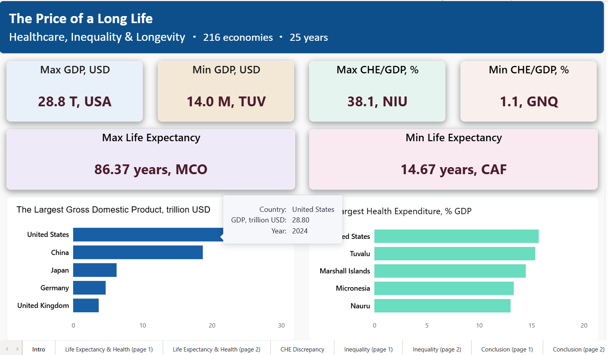

# Health, Wealth & Longevity

## Project Overview

This project explores the relationship between healthcare expenditure, economic development, income inequality, and life expectancy across countries.

The analysis combines multiple public datasets, integrates them into a unified data model, and visualizes the results in Power BI.

---

## Dashboard Preview



---

## Objectives

- Investigate whether higher healthcare spending is associated with longer life expectancy.
- Examine the relationship between GDP, healthcare expenditure, and life expectancy.
- Explore the impact of income inequality on health outcomes.
- Build a clean analytical data model suitable for further SQL and Power BI analysis.

---

## Data Sources

| Dataset | Source |
|---|---|
| Healthcare expenditure (% of GDP) | Our World in Data |
| GDP, current US$ | World Bank |
| Life expectancy | Our World in Data |
| Gini coefficients | Harvard Dataverse |
| Country and lending groups | World Bank |

- Healthcare expenditure: https://ourworldindata.org/search?q=healthcare+expenditure&resultType=all
- GDP: https://data.worldbank.org/indicator/NY.GDP.MKTP.CD
- Life expectancy: https://ourworldindata.org/search?q=life+expectancy&resultType=all
- Gini coefficients: https://dataverse.harvard.edu/dataset.xhtml?persistentId=doi:10.7910/DVN/LM4OWF
- Country groups: https://datahelpdesk.worldbank.org/knowledgebase/articles/906519-world-bank-country-and-lending-groups

---

## Data Preparation

The raw datasets required significant preprocessing before analysis.

### Data cleaning

- Standardized country names across multiple datasets.
- Renamed columns using consistent naming conventions.
- Removed duplicate records.
- Converted wide-format tables into long-format tables where necessary.
- Standardized data types.

### Data integration

- Created a separate Country dimension table.
- Added additional fields required for building relationships.
- Established a star schema data model in Power BI.

---

## Tools

- Power BI
- Power Query
- Microsoft Excel

(SQL scripts will be added in the next stage of the project.)

---

## Repository Structure

```
data/
    processed/

powerbi/

images/

README.md
```

---

## Dashboard

Dashboard screenshots will be added here.

---

## Future Improvements

- Rebuild the complete data preparation workflow in SQL (BigQuery).
- Add analytical SQL queries.
- Extend the analysis with additional statistical indicators.
